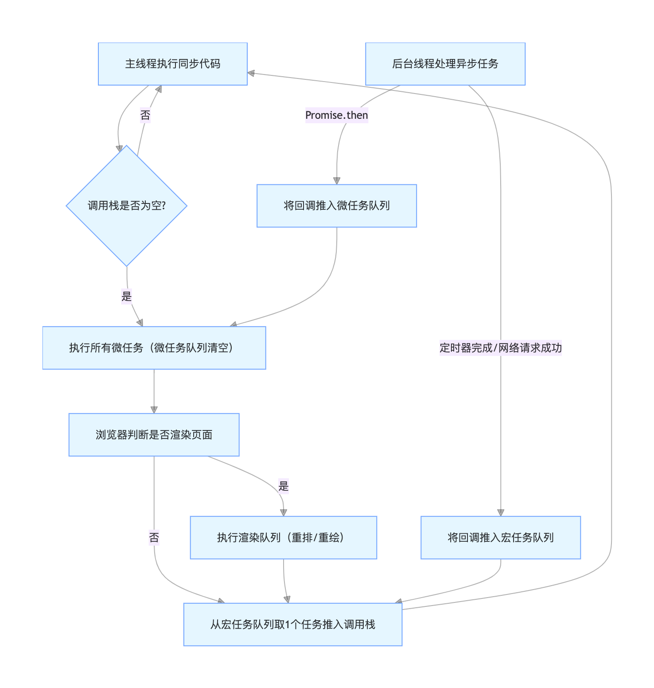

# 浏览器事件循环机制
事件循环的本质：“从任务队列取任务，执行，再取，再执行”的循环

执行完当前的同步代码，清空所有微任务 ，浏览器渲染 （可能跳过），从宏任务队列再取一个任务执行，再次清空所有微任务，循环往复。

通过以上过程 ，可以看出浏览器的渲染和javascript引擎也是相互阻塞的。

- 浏览器的 宏任务队列 包括 ：setTimeout、setInterval、I/O、UI 交互事件、setImmediate
- 对于setTimeout构成构成的循环，每次事件循环会消费之前setTimeout留下的回调 ，但不会执行当前回调注册的新回调，而是留到下次事件循环中执行。这也意味着setTimeout构成的循环需要消耗的时间不会太短，至少要等待4ms才会执行，即便setTimeout的延迟时间为0。
- 大量定时器会阻塞主线程，导致页面卡顿。导致用户交互和DOM更新等关键操作堵在后边，影响用户体验。
- 浏览器的 微任务队列 包括 ：Promise、MutationObserver
- 如果有一个无限循环的微任务，会导致事件循环 never end，浏览器会一直阻塞在这个微任务上，导致页面卡顿。

